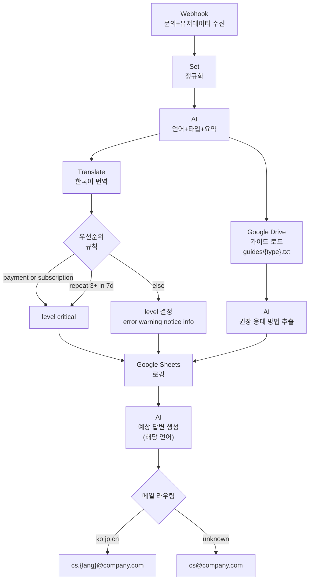

# 유저 문의 자동 분류/응대 워크플로우

> 목적: 사이트 문의가 들어오면 n8n이 **(1) 문의/유저데이터 수신 → (2) AI로 언어/타입 분류 → (3) 내부 문서 기반 권장 응대 방법 추출 → (4) 우선순위(가중치) 산정 → (5) Google
Sheets 로깅 → (6) 해당 언어로 예상 답변 생성 → (7) 언어별 CS 담당자에게 메일 발송**까지 수행합니다.

## 1) 전제/규칙(요약)

- 입력 소스: API가 문의 DB 저장 후 n8n(Webhook)으로 데이터 전달
    - `inquiry`: 원본 문의
    - `user`: 회원만
    - `history`: 이전 문의 내역(회원만)
- 비회원: `user/history`가 없거나 제외됨(반복 문의 카운트 산정에서 제외)
- 언어 코드(사내): `ko`, `jp`, `cn`, `tw`, `en(기본값)`
- 문의 타입(확장 가능):
    - `account`, `invoice`, `subscription`, `feature`, `word-extension-feature`, `chrome-extension-feature`, `payment`,
      `marketing`, `sales`, `etc`
- 레벨(가중치): `critical`, `error`, `warning`, `notice`, `info`
- 가이드 문서 규칙(확정): `guides/{type}.txt` (Google Drive)

## 2) 플로우(핵심 단계)

### Step 1) Webhook 수신 & 정규화

- 필수 필드 검증 후 표준 스키마로 정규화

### Step 2) AI 분류(언어/타입/요약)

- 입력: 원본 문의 + (회원이면) 유저 요약/최근 문의 요약
- 출력(권장)
    - `lang`: `ko|jp|cn|...`
    - `type`: 분류 타입 1개
    - `summary_local_1line`: 해당 언어 30자 이내(메일 제목)
    - `summary_ko_short`: 한국어 한줄 요약(로깅)
    - `summary_ko_brief`: 한국어 핵심 요약(로깅/메일)

### Step 3) 내부 문서 로드 & 권장 응대 방법 추출

- Google Drive에서 `guides/{type}.txt` 로드
- AI가 문서 기반으로 권장 응대 방법을 구조화하여 추출
- 출력(권장)
    - `guide_ko_oneliner`
    - `guide_ko_detail`(필요 시 발췌)

### Step 4) 우선순위(가중치) 산정

- 확정 규칙
    - `type in [payment, subscription]` → `level=critical`
    - 회원이 7일 내 3회 이상 반복 문의 → `level=critical`
- 그 외: `error|warning|notice|info` 중 규칙 또는 AI로 결정

### Step 5) Google Sheets 로깅

- 기록 컬럼(요구사항)
    - `문의 언어, 문의 레벨(가중치), 문의 타입, (원본) 문의 내용, (한국어 번역) 문의 내용, 문의 내용 AI 한국어 요약, 권장 응대 방법, 문의 이메일, (비회원 제외)회원 번호, 문의 시간`

### Step 6) 예상 답변 생성(유저 언어)

- 입력: 원본 문의 + 요약 + 권장 응대 방법 + 확인사항(누락정보 등)
- 출력: 예상 답변(해당 `lang`)

### Step 7) CS 담당자 메일 발송

- 수신자
    - 기본: `cs.{lang}@company.com`
    - 미지원/unknown: `cs@company.com`
- 제목 형식(요구사항)
    - `[lang][level][type] {summary_local_1line}`
- 본문 포함(요구사항)
    - `(원본) 문의 내용, 문의 내용 AI 요약, (권장)예상 문의 답변, 문의 이메일, (비회원 제외)회원 번호, 문의 시간`

## 3) Mermaid 플로우 차트

