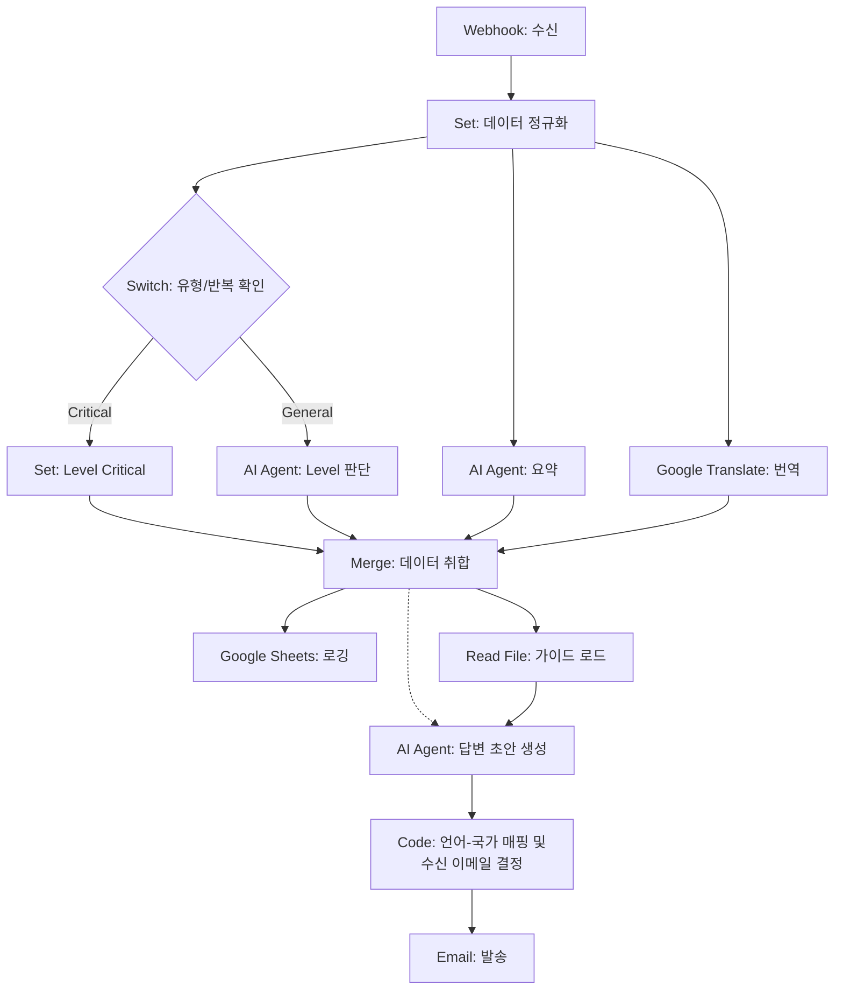

# 유저 문의 자동 분류/응대 워크플로우

## 요약

1. 분석
    - 고객 문의가 들어오면 중요도 판단, 내용 요약, 한국어 번역을 수행하여 데이터를 정리
2. 기록
    - 분석된 모든 정보를 하나로 합쳐 구글 시트에 저장
3. 답변
    - 문의 유형(예: 결제, 계정)에 딱 맞는 가이드 파일 하나를 서버에서 찾아 확인
    - AI가 문의 내용과 가이드를 참고하여 정확한 답변 초안을 작성
4. 자동 발송
    - 고객의 언어(한국어, 영어 등)를 확인하여 적절한 담당자 주소로 이메일을 발송

---

## 상세 플로우

### Step 1. 수신 및 정규화

- Node: `Webhook` → `Set` (Norm)
- 역할: 수신된 데이터에서 `user`, `content`, `type`, `is_repeat`, `language` 등 핵심 필드 정규화
- Response: `data`

### Step 2. 병렬 분석 (Parallel Execution)

`Norm` 노드 이후, 데이터 흐름이 3갈래로 나뉘어 동시에 실행됩니다.

[Track A: 유형 및 레벨 판정]

- Node: `Switch` (Switch_Type)
    - 조건: `type`이 결제/구독이거나 `is_repeat`가 true인가?
- 분기 결과:
    1. Yes: `Set` (Set_Crit) → `level = 'critical'` 로 강제 할당 (규칙 확정)
    2. No: `AI Agent` (AI_Level) → LLM이 내용 분석 후 레벨 판정
- Response: `level` (`critical`, `error`, `warning`, `info`)

[Track B: 내용 요약]

- Node: `AI Agent` (AI_Sum)
- 역할: 원본 내용을 40자 이내로 요약
- Response: `summary`

[Track C: 번역]

- Node: `Google Translate` (Trans)
- 역할: 원본 내용을 한국어로 번역하고, 문의 내용의 언어를 확인
- 주의: 유저 국가 정보와 문의 언어는 달라질 수 있음. (ex. 한국 유저가 영어로 문의하면, 영어로 답변해야 함)
- Response: `language`, `translated_text`

### Step 3. 데이터 병합 (Merge)

- Node: `Merge` (Merge Node)
- 입력: `Set_Crit` OR `AI_Level` (Track A), `AI_Sum` (Track B), `Trans` (Track C)
- 역할: 흩어진 분석 데이터(레벨, 요약, 번역)를 원본과 하나로 취합
- Response: 병합된 데이터 객체 (정규화된 `data` + `level`, `summary`, `language`, `translated_text`)

### Step 4. 로깅 (Logging Branch)

- Node: `Google Sheets` (Log)
- 연결: `Merge` → `Log`
- 역할: 병합된 모든 데이터를 시트에 기록하고 이 브랜치는 종료

### Step 5. 가이드 로드 (File Loading)

- Node: `Read Binary File` (Load_File)
- 연결: `Merge` → `Load_File`
- 경로: `/home/node/.n8n/guides/{{ $json.type }}.md` (Expression 활용)
- 역할: 문의 유형(`type`)에 맞는 로컬 가이드 문서 로드
- Response: `guide` (가이드 문서 내용)

### Step 6. 답변 생성 (Drafting)

- Node: `AI Agent` (AI_Draft)
- 연결:
    1. `Merge` (Main Input: 문의 내용, 레벨)
    2. `Load_File` (Reference Input: 가이드 문서 내용)
- 역할: 로드된 가이드를 참조하여 답변 초안 작성
- Response: `expected_response` (AI가 생성한 답변 초안)

### Step 7. 주소 매핑 (Address Mapping)

30개 이상의 국가별 담당자 이메일 주소를 효율적으로 관리하기 위해 Code 노드를 사용하여 매핑 로직을 수행합니다.

- Node: `Code` (Map_Address)
- 역할: 사용자 언어 코드(`lang`)를 기준으로 최종 수신 이메일 주소(`target_email`)를 확정합니다.
- 작동 원리:
    1. 노드 내부에 [언어 코드 : 이메일 주소] 형태의 매핑 리스트를 정의합니다. (예: 한국어는 `cs.kr@...`, 일본어는 `cs.jp@...` 등 30개국)
    2. 입력된 사용자의 언어가 지원 언어 리스트에 있으면 해당 국가 담당자 이메일을 선택합니다.
    3. 리스트에 없는 언어라면 기본값인 Global 담당자 주소(`cs@company.com`)를 선택합니다.
- 관리 포인트: 국가나 담당자가 추가될 경우, 이 노드 내부의 리스트만 수정하면 됩니다.
- Response: `manager_email` (문의 담당자 이메일 주소)

### Step 8. 메일 발송 (Final Sending)

이전 단계에서 결정된 주소를 받아, 복잡한 설정 없이 단순히 발송만 수행합니다.

- Node: `Email` (Mail_Send)
- 수신자(To) 설정: Step 7에서 계산된 `manager_email` 변수 값을 그대로 사용합니다.
- Action: AI가 작성한 답변 초안과 원본 문의 내용을 포함하여 최종 담당자에게 이메일을 발송합니다.
